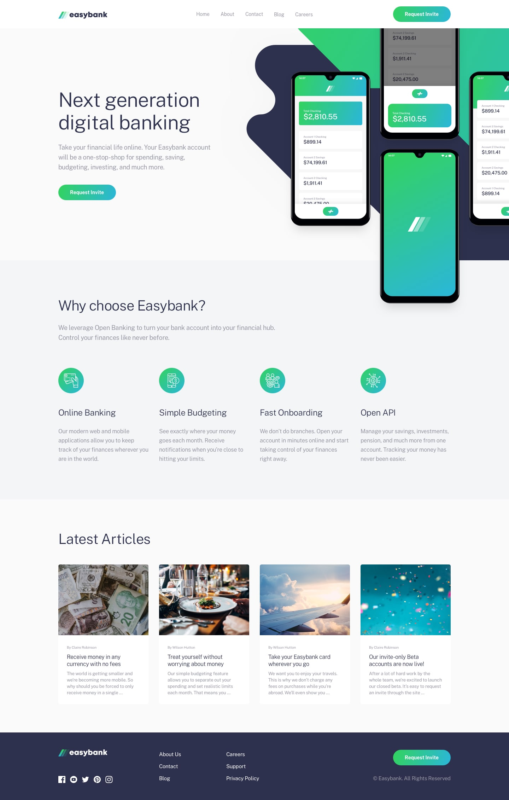

# Easybank-landing-page

This is my solution to the [Easybank landing page challenge on Frontend Mentor](https://www.frontendmentor.io/challenges/easybank-landing-page-WaUhkoDN). Frontend Mentor challenges help you improve your coding skills by building realistic projects.  

## Built with

- Semantic HTML5 markup
- CSS custom properties
- Flexbox
- Vanilaa JS components

## Links
Link to site: https://annarippert.github.io/Easybank-landing-page/
